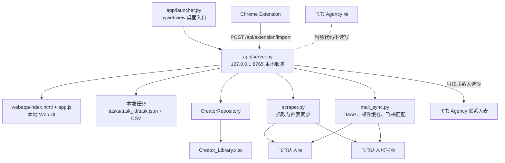
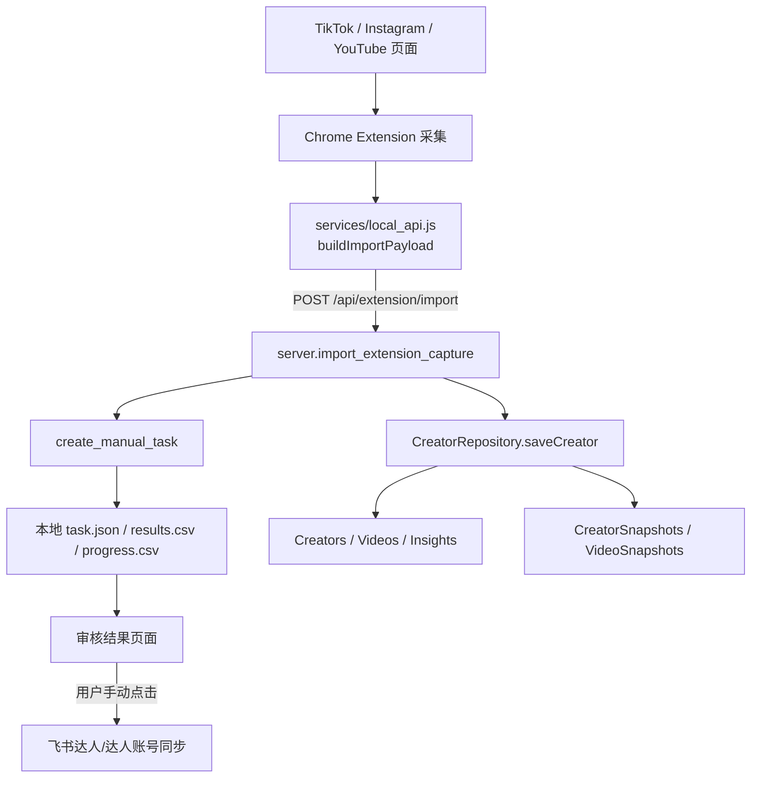

# KOLConnect v0.2.0 产品结构重构方案

> 文档性质：只读审计与产品方案
> 审计基线：KOLConnect v0.1.2
> 目标版本：KOLConnect v0.2.0
> 结论先行：v0.2.0 应采用“Tool 主体化”，保留现有飞书四表作为可选兼容集成，不应继续把理解和维护四表作为普通用户的使用前提。

## 1. 当前真实架构

### 1.1 运行架构



实际运行文件：

| 层级 | 文件 | 当前职责 |
| --- | --- | --- |
| 桌面入口 | `app/launcher.py` | 启动本地 Server、创建 pywebview 窗口、保存窗口尺寸、切换 scraper worker 模式 |
| 路径与本地文件 | `app/runtime_paths.py` | `%APPDATA%\KOLConnect`、日志目录、JSON 原子写入 |
| 本地 API | `app/server.py` | 页面 API、任务、审核、插件导入、达人库、Dashboard、邮件、飞书配置和同步入口 |
| 任务存储 | `app/task_manager.py` | `task.json`、`links.txt`、`results.csv`、`progress.csv` 和任务状态 |
| 抓取与飞书同步 | `app/scraper.py` | 链接标准化、账号 UID、平台抓取、结果 CSV、达人/达人账号表同步 |
| 邮件 | `app/mail_sync.py` | IMAP 同步、本地邮件缓存、按飞书账号邮箱匹配、回复状态回写达人表 |
| 达人库存储 | `app/creator_repository.py` | Excel 工作簿创建、读取、保存、Snapshot、合作记录和备份 |
| 工作台数据 | `app/dashboard_repository.py`、`app/dashboard_service.py` | 只通过 CreatorRepository 计算 Dashboard 数据 |
| Web UI | `webapp/index.html`、`webapp/app.js`、`webapp/styles.css` | 当前全部页面、状态管理和 API 调用 |
| 插件导入 | `chrome_extension/services/local_api.js` | 生成导入 payload 并调用 `/api/extension/import` |

### 1.2 本地数据位置

默认写入 `%APPDATA%\KOLConnect`：

| 数据 | 位置 | 作用 |
| --- | --- | --- |
| 设置 | `settings.json` | 界面、Profile、邮箱、飞书、达人库文件路径 |
| 任务 | `tasks/<task_id>/` | 抓取、人工录入、邮箱补全及审核结果 |
| 人工字段保护 | `data_protection.json` | 按账号 UID 保存人工字段及来源优先级 |
| 达人库 | `Creator_Library.xlsx` | Creator Library、Snapshot、Insight、合作记录 |
| 邮件缓存 | `mail_messages.json` | 邮件摘要、匹配结果和同步状态 |
| 诊断 | `system_diagnostics.json` | 最近插件导入、最后错误等 |
| 日志 | `logs/` | 应用和错误日志 |
| 旧数据兼容 | `creator_analysis/`、`creator_library.json` | 仅供旧 JSON 数据迁移到 Excel |

## 2. 当前真实页面与入口

### 2.1 顶层导航

当前 `webapp/index.html` 实际存在五个顶层入口：

1. **工作台**：Dashboard。
2. **发现达人**：实际打开抓取任务页。
3. **达人库**：只展示已进入 CreatorRepository 的达人分析。
4. **合作管理**：实际打开邮件账户和收件箱页面，不是完整合作管理中心。
5. **设置**：界面、Profile、调试、健康检查、达人库路径、飞书配置。

### 2.2 次级和内部页面

| 页面 | 是否直接导航 | 当前作用 |
| --- | --- | --- |
| 抓取任务 | 是，次级 | 自动抓取、人工录入、任务列表和运行日志 |
| 审核结果 | 是，次级 | 编辑任务 CSV、重试异常、手动同步飞书 |
| 链接清洗 | 是，次级 | 标准化主页链接 |
| 账号管理 | 是，次级 | 管理抓取所用 Chrome Profile，不是达人账号管理 |
| 邮件与联系 | 是，次级 | 邮箱账户、收件箱、飞书回复状态同步 |
| 系统日志 | 是，次级 | 查看运行日志 |
| 达人详情 | 内部跳转 | 分析、Snapshot、合作记录 |
| 任务详情 | 内部跳转 | 查看和维护任务链接 |

当前不存在：

- 独立的达人账号管理页面。
- Agency 列表或详情页面。
- Agency 联系人列表或详情页面。
- 统一的达人/Agency 跟进看板。
- 全局合作记录页面。
- Excel 导入或协作导出页面。

## 3. 当前真实数据模型

| 对象 | 当前是否存在 | 真实位置 | 关键结论 |
| --- | --- | --- | --- |
| Creator | 是 | Excel `Creators` | 名称上是达人，实际上同时保存平台、主页和粉丝，混合了达人主体与账号属性 |
| Creator Account | 本地没有独立实体 | 任务 CSV、Snapshot 的 `account_uid`、飞书达人账号表 | 没有本地 `CreatorAccounts` Sheet，也没有独立 UI |
| Snapshot | 是 | `CreatorSnapshots` | 保存每次插件分析的粉丝、播放和 Insight 概览 |
| Video | 是 | `Videos` | 保存当前最新视频集合；同一 Creator 再导入时会替换 |
| Video Snapshot | 是 | `VideoSnapshots` | 保存每次 Snapshot 对应的视频指标 |
| Insight | 是 | `Insights` | 保存当前最新计算结果 |
| Cooperation | 是 | `Cooperations` | 仅本地 Excel，达人详情内可新增和查看 |
| Agency | Tool 中不存在 | 仅飞书表和后端配置占位 | 当前代码不创建、不读取、不更新 Agency 表 |
| Agency Contact | 仅部分存在 | 飞书 Agency 联系人表 | Tool 只读联系人列表，供人工录入任务选择“来源联系人” |
| Task | 是 | 本地任务目录 | `scrape`、`manual`、`email_recheck` 三类 |
| Mail | 是 | 本地 JSON + 飞书关联 | 邮件缓存本地保存，但达人匹配依赖飞书达人账号/达人关系 |

最重要的数据模型事实：

1. 当前本地 `Creators` 不是严格的“真实达人主体”表。一条记录对应一个插件导入账号，`platform`、`profile_url`、`followers` 直接位于 Creator 行。
2. `account_uid = platform + 标准主页链接` 是跨任务和飞书达人账号的稳定账号标识。
3. 同一账号重复插件导入时，Creator 不重复，新增 Snapshot；但仍会创建新的人工任务。
4. 同一个真实达人拥有多个平台账号时，当前本地 Excel 不会自动合并为一个达人主体。
5. 本地 `creator_id` 与飞书达人表中的“达人ID”不是同一个 ID；当前没有本地与飞书达人主体的稳定双向映射。

## 4. Excel 当前真实结构

当前 schema version 为 `1.3`。

| Sheet | 类型 | 当前用途 | 写入行为 | 普通用户是否应直接编辑 |
| --- | --- | --- | --- | --- |
| `Creators` | 当前主数据视图 | 名称、平台、主页、国家、语言、粉丝、标签、状态 | 同账号导入时更新最新值 | 不建议；ID、主页和字段名被程序依赖 |
| `Videos` | 最新数据 | 当前最新视频集合 | 每次导入替换该 Creator 的旧行 | 不应手工修改 |
| `Insights` | 最新计算结果 | 平均播放、中位播放、稳定性、风险、建议 | 每次导入更新 | 不应手工修改 |
| `CreatorSnapshots` | 历史快照 | 每次分析的账号指标 | 按 `snapshot_id` 新增或更新 | 不应手工修改 |
| `VideoSnapshots` | 历史快照 | 每次分析对应的视频指标 | 按 Snapshot 保存 | 不应手工修改 |
| `Cooperations` | 运营记录 | 合作项目、价格、播放、ROI、结果、备注 | Tool 追加 | 应通过 Tool 编辑；直接改 ID 有关联风险 |
| `_AnalysisData` | 隐藏技术数据 | 完整 analysis JSON、task_id、account_uid | 每次导入更新 | 禁止手工修改 |
| `_Metadata` | 隐藏技术数据 | schema version、更新时间 | 每次保存更新 | 禁止手工修改 |

当前工作簿不等于飞书四表，也没有：

- `CreatorAccounts`
- `Agencies`
- `AgencyContacts`
- `FollowUps`

当前保存机制会先写临时文件、验证可读性、生成 `.xlsx.bak`，再替换正式文件。进程内有写锁，但 WPS/云盘多设备同时写入仍可能产生冲突。

## 5. 飞书当前真实同步

### 5.1 实际使用的四表

| 飞书表 | 当前代码行为 |
| --- | --- |
| 达人 | 读取已有记录；新建达人；仅补充空的名称、WhatsApp、备注；邮件同步可更新合作阶段和最近联系时间 |
| 达人账号 | 读取、按账号唯一ID去重；新建账号；仅补充空字段；作为邮件匹配和缺失邮箱扫描来源 |
| Agency | 配置结构中保留 `agency_table_id`，但当前没有读取或写入逻辑 |
| Agency 联系人 | 只读联系人姓名、WhatsApp、所属 Agency 显示值和 `record_id`，供人工任务选择来源联系人 |

“四表同步”这个名称容易造成误解：当前自动写入核心只有达人表和达人账号表，Agency 表不参与，Agency 联系人表只读。

### 5.2 字段映射位置

字段名称硬编码在：

- `app/scraper.py`：达人和达人账号字段、创建、更新、候选关系。
- `app/mail_sync.py`：账号邮箱、达人关联、合作阶段、最近联系时间。
- `app/server.py`：Agency 联系人字段和设置字段。

字段名称、类型或关联目标发生变化时，相关 API 会失败。当前没有运行时字段映射配置层。

### 5.3 同步方向

当前不是完整双向同步：

```text
任务结果 --手动点击--> 飞书达人/达人账号
飞书达人账号/达人 --只读--> 邮件匹配
飞书达人账号 --只读--> 缺失邮箱补全任务
飞书 Agency 联系人 --只读--> 来源联系人下拉框
邮件匹配结果 --手动点击--> 飞书达人合作阶段/最近联系时间
```

不存在：

- 飞书达人数据完整拉取到 Creator Library。
- 本地合作记录同步到飞书。
- 本地达人状态与飞书合作阶段自动对齐。
- 飞书 Agency 和联系人完整同步到本地。

### 5.4 自动字段与人工字段

Tool 自动或条件写入的主要字段：

- 达人：达人名称、达人ID、默认国家/语言/合作阶段、空 WhatsApp、空备注、人工任务新达人来源联系人。
- 达人账号：账号唯一ID、平台、主页链接、账号邮箱、邮箱来源、粉丝数、最近发布时间、最近抓取时间、数据来源、抓取状态、归属状态、达人或疑似达人关联。
- 邮件回复：符合保护条件时更新合作阶段为“跟进中”，并更新最近联系时间。

Tool 明确保留、不覆盖的主要人工字段：

- 已有达人名称、WhatsApp、备注。
- 负责人、报价、标签、下次跟进时间、所属机构、相关联系人。
- 已有账号邮箱、账号备注及已有人工关系。
- Agency 和 Agency 联系人全部人工字段。

### 5.5 飞书是否为必需依赖

飞书不是 Tool 启动、普通抓取、人工任务、插件导入、Creator Library 或本地合作记录的必需依赖。

以下功能当前依赖飞书：

- 将任务同步到达人/达人账号表。
- 扫描飞书达人账号表的缺失邮箱。
- 邮件按达人账号邮箱匹配达人。
- 将邮件回复状态写回达人表。
- 人工录入时选择来源联系人。

因此，飞书在技术上已经是“部分功能依赖”，但当前文档和设置仍把它表达为核心数据库和首次配置项。

## 6. Chrome Extension 当前导入链路



真实行为：

1. 插件提交基础资料、视频和分析结果。
2. 后端先创建一个人工录入任务，使数据进入审核流程。
3. 同一份 payload 同时写入 Creator Library Excel。
4. 同账号重复导入不会新增 Creator，但会新增 Snapshot，并创建新的人工任务。
5. 导入不会自动同步飞书。
6. 普通抓取任务和普通人工录入任务不会自动进入 Creator Library；目前只有插件导入调用 `saveCreator()`。

## 7. 用户困惑的根因

### 7.1 复杂度分类

#### A. Tool 界面复杂

- “合作管理”实际是邮件页面，名称与内容不一致。
- “账号管理”实际是 Chrome Profile，不是达人账号。
- 抓取、审核、达人库是三个入口，但数据不会自动形成统一达人记录。
- 达人详情包含合作记录，但没有统一合作或跟进入口。
- Agency 只在人工录入来源联系人下拉框中出现，用户看不到完整 Agency 数据。

#### B. 飞书表格复杂

- 普通用户需要理解四张表、双向关联、record_id、Table ID 和字段类型。
- 达人主体、账号、Agency、联系人需要跨表跳转。
- 当前自动化实际只覆盖其中两张半表，却要求用户理解完整四表。

#### C. 数据模型复杂

- 本地 Creator 与账号属性混合。
- 本地、任务和飞书各自有不同 ID。
- Creator Library、任务 CSV 和飞书不是同一个实时数据集。
- 合作状态在本地 `status` 和飞书“合作阶段”中分别维护。

#### D. 文档解释复杂

- 用户说明把飞书配置放在首次使用前置步骤。
- README 表述 Tool 可以“管理 Agency”，但当前 Tool 没有 Agency 页面和本地 Agency Repository。
- 飞书指南同时描述目标四表、现有实现差异和大量保护规则，新用户难以判断日常操作入口。

#### E. Tool、Excel、飞书职责重叠

- Creator Library 的状态和合作记录只在 Excel。
- 联系阶段和负责人主要在飞书。
- 任务审核数据在 CSV。
- 邮件缓存本地保存，但匹配关系来自飞书。
- 用户不知道哪个系统中的同名字段才是最终值。

### 7.2 用户从哪里开始困惑

最早的困惑发生在首次使用：用户被要求先配置飞书 App、Base 和多张 Table ID，尚未完成一次“发现达人 → 保存达人”的流程，就需要理解底层数据库关系。

第二个困惑发生在插件或抓取完成后：数据同时出现在任务审核和 Creator Library，但两者覆盖范围不同；只有点击飞书同步后，才进入另一套数据体系。

第三个困惑发生在跟进阶段：邮件、合作记录、达人状态和飞书合作阶段分散在不同页面与存储中。

### 7.3 必要与可隐藏的复杂度

必须保留但应由系统隐藏：

- Creator 与账号的一对多关系。
- account_uid、creator_id、snapshot_id、video_id。
- Snapshot 和历史数据。
- Agency 与联系人的关联。
- 字段来源和冲突优先级。

普通用户不应直接看到或维护：

- record_id、Table ID、Snapshot ID。
- “达人账号.达人”和“疑似达人候选”的底层关联。
- `_AnalysisData`、`_Metadata`。
- 飞书反向关联字段。
- 账号唯一ID生成规则和数据保护索引。

不应继续要求用户在飞书完成：

- 日常达人资料维护。
- 达人阶段、报价、标签、负责人和下次跟进的主要操作。
- Agency 和联系人日常维护。
- 合作记录和复盘。
- 为了使用插件或达人库而先理解四表。

## 8. 方案 A 与方案 B 对比

评分规则：5 分为该维度最优；“开发成本”和“维护成本”中，分数越高表示成本越低。

| 维度 | 方案 A：保留四表为主并简化视图 | 方案 B：Tool 主体化 |
| --- | ---: | ---: |
| 易用性 | 2 | 5 |
| 开发成本 | 4 | 2 |
| 数据安全 | 4 | 4 |
| 维护成本 | 2 | 4 |
| 扩展能力 | 2 | 5 |
| 对现有代码影响 | 5 | 2 |
| 对现有飞书数据影响 | 5 | 4 |
| 总体适配个人/小团队 | 2 | 5 |

### 8.1 方案 A：继续使用飞书四表，但简化

优点：

- 改动小，现有同步和邮件流程可直接继续。
- 飞书视图、权限和多人协作成熟。
- 不需要迁移现有飞书数据。

局限：

- 隐藏字段不能消除关联关系本身，用户仍需理解达人、账号、Agency、联系人。
- 字段名称和关联类型仍是 API 硬依赖。
- 新用户仍需配置飞书应用、权限、Base 和 Table ID。
- Tool 与飞书的状态重叠不会解决。
- Google Sheets 无法复用飞书关联模型。

结论：适合作为短期兼容方案，不适合作为 v0.2.0 的产品主方向。

### 8.2 方案 B：Tool 主体化

优点：

- 用户只围绕达人、Agency 和跟进工作。
- 账号与联系人关系可以在详情页内呈现，不占主导航。
- Excel、飞书、Google Sheets 的职责可以明确分层。
- 后续替换存储或增加协作渠道时，UI 与业务流程无需重做。

成本与风险：

- 必须把本地 Creator 与账号拆分为稳定关系。
- 必须补齐本地 Agency、联系人和跟进数据。
- 需要非破坏性迁移现有 Excel。
- 邮件匹配需逐步从“只认飞书”过渡到优先使用本地账号。

结论：开发成本较高，但能真正解决用户困惑。

## 9. 最终推荐方案

明确推荐：**选择方案 B，采用分阶段 Tool 主体化；方案 A 仅作为兼容适配层保留。**

原则：

1. KOLConnect Tool 是唯一日常操作入口。
2. 系统工作簿是本地主数据和备份载体，但不作为普通用户直接操作界面。
3. 飞书和 Google Sheets 是可选协作副本，不决定 Tool 能否使用。
4. v0.1.2 飞书 API 暂不删除，移入“可选集成/兼容模式”。
5. 先建立本地权威关系，再改变页面；不先做漂亮 UI 后补数据模型。
6. 不自动合并同名达人，不自动推断 Agency 归属。

## 10. v0.2.0 页面结构

建议顶层导航：

1. **工作台**
2. **达人**
3. **Agency**
4. **跟进**
5. **设置**

现有功能重组：

| v0.2.0 入口 | 复用或调整的现有页面 |
| --- | --- |
| 工作台 | 直接复用当前 Dashboard，不开发第二套首页 |
| 达人 | 达人库作为默认页；“发现/导入”收纳抓取任务、人工录入、链接清洗；“待审核”复用审核结果 |
| Agency | 新增最小 Agency 列表和详情；联系人嵌入 Agency 详情 |
| 跟进 | 新增统一看板；邮件与联系、合作记录作为二级内容 |
| 设置 | 保留界面、Profile、日志、健康检查；飞书移入“可选集成”折叠区 |

内部页面继续保留：

- 任务详情。
- 达人详情。
- 系统日志。
- Chrome Profile 管理。

但不再将技术性页面作为主要业务概念。

## 11. 达人详情设计

达人详情以真实达人主体为中心，不以单个平台账号为中心。

### 11.1 顶部摘要

- 达人名称。
- 国家/地区、语言。
- 合作阶段。
- 负责人。
- 下次跟进时间。
- 所属 Agency。
- 当前联系人。
- 来源联系人。

### 11.2 Tab 结构

#### 概览

- 达人名称、邮箱、WhatsApp、备注。
- 标签、报价、近期合作产品。
- 合作阶段、负责人、最近联系时间、下次跟进时间。
- Agency、当前联系人、来源联系人。

#### 社媒账号

每个平台以卡片显示：

- 平台、主页链接、账号唯一ID。
- 粉丝数、账号邮箱、最近发布时间、最近抓取时间。
- 数据来源、抓取状态。
- 最新 Snapshot 和重新分析入口。

账号不作为普通用户独立主导航，但高级用户可在达人详情内查看技术字段。

#### 数据趋势

- CreatorSnapshots。
- VideoSnapshots。
- 最新与上次变化。
- 数据新鲜度。

#### 合作记录

- 沿用现有 `Cooperations`。
- 价格、发布数量、播放、ROI、结果、备注。

#### 跟进记录

- 电话、WhatsApp、邮件、备注等人工跟进记录。
- 阶段变化记录。
- 下次跟进时间。

### 11.3 多账号归并规则

- 账号唯一ID继续保持现有规则。
- 新账号默认进入“待确认归属”。
- 只允许人工确认“归属于已有达人”或“创建新达人”。
- 不按昵称、邮箱或名称自动合并。

## 12. Agency 详情设计

当前 Tool 没有 Agency 管理能力。v0.2.0 需要最小实现，不应把飞书页面包装成已经存在的功能。

### 12.1 Agency 列表

- Agency 名称。
- 国家/地区。
- 合作阶段。
- 当前联系人。
- 旗下达人数。
- 负责人。
- 下次跟进时间。

### 12.2 Agency 详情

#### 基础资料

- Agency 名称、官网、国家/地区。
- 公共邮箱、WhatsApp。
- 合作阶段、标签、负责人、备注。
- 最近联系时间、下次跟进时间。

#### 联系人

- 当前联系人。
- 历史联系人。
- 姓名、职位、邮箱、WhatsApp、语言、归属状态。
- 联系人只作为 Agency 内嵌实体，不建立普通用户独立主导航。

#### 旗下达人

- 已确认属于 Agency 的达人。
- 来源联系人和当前联系人分开显示。
- 联系人变更不得自动改变达人 Agency。

#### 资料文件

- 保存 Agency PPT、达人名单和合作资料的文件路径或附件引用。
- 第一阶段只管理引用，不解析文件内容。

#### 跟进记录

- 最近跟进、下次跟进、记录内容和负责人。

## 13. 跟进看板设计

建议新增统一看板，因为当前 Dashboard 只有统计，邮件页面也不能承载完整跟进工作。

看板同时支持达人和 Agency：

| 阶段 | 含义 |
| --- | --- |
| 未联系 | 已进入库但尚未联系 |
| 已联系 | 已完成首次联系 |
| 跟进中 | 已有互动，需要持续跟进 |
| 已报价 | 已发送或收到报价 |
| 洽谈中 | 正在讨论具体合作 |
| 暂不合作 | 当前不推进，但保留关系 |
| 已合作 | 已完成至少一次合作 |
| 其他 | 无法归入以上阶段 |

卡片最少显示：

- 对象类型：达人或 Agency。
- 名称。
- 当前阶段。
- 负责人。
- 最近联系时间。
- 下次跟进时间。
- 逾期状态。

迁移时不要直接覆盖当前英文状态。应先生成建议映射并人工确认，尤其是 `cooperating`、`completed` 和 `rejected`。

## 14. 工作台复用方案

当前 Dashboard 已经具备：

- 达人总数、本周新增、待联系、合作中。
- 合作花费、播放和 ROI。
- 上升、下滑和数据过期达人。
- 待联系与合作记录缺失。

v0.2.0 应扩展当前 DashboardService，而不是新建第二套首页：

- 今日跟进。
- 已逾期跟进。
- 新导入达人。
- 待确认账号归属。
- 最近抓取失败。
- 最近更新记录。

所有数据继续通过 Repository/Service/API 返回，不让前端直接读取 Excel 或自行计算业务指标。

## 15. Excel 存储与导出设计

### 15.1 系统数据文件

系统工作簿是 KOLConnect 的内部存储、备份和恢复文件。必须保留内部 ID、关联关系、Snapshot、Insight 和历史记录。

建议 v0.2.0 非破坏性扩展：

| Sheet | 规划 |
| --- | --- |
| `Creators` | 调整为真实达人主体；保留旧列兼容，不立即删除 |
| `CreatorAccounts` | 新增；保存 account_uid、平台、主页、账号邮箱及最新账号状态 |
| `CreatorSnapshots` | 保留；明确关联 creator_id 和 account_uid |
| `Videos`、`VideoSnapshots`、`Insights` | 保留 |
| `Cooperations` | 保留 |
| `Agencies` | 新增 |
| `AgencyContacts` | 新增 |
| `FollowUpLogs` | 新增；统一保存达人和 Agency 跟进历史 |
| `_AnalysisData`、`_Metadata` | 保留并继续隐藏 |

系统工作簿不应作为普通用户日常编辑入口。Tool 保存时继续使用临时文件、验证、备份和替换流程。

### 15.2 协作导出文件

协作导出与系统工作簿必须分开。建议生成：

#### 达人总览

一行一个达人，包含：

- 达人名称。
- 主要平台。
- TikTok、Instagram、YouTube 主页。
- 各平台或主要账号粉丝量。
- 国家/地区。
- Agency。
- 当前联系人。
- WhatsApp。
- 合作阶段。
- 报价。
- 下次跟进时间。
- 负责人。
- 备注。

#### Agency 总览

- Agency 名称、国家、官网。
- 当前联系人和联系方式。
- 合作阶段。
- 旗下达人数。
- 负责人、下次跟进时间、备注。

#### 待跟进事项

- 对象类型、名称、阶段。
- 最近联系时间。
- 下次跟进时间。
- 负责人。
- 是否逾期。

### 15.3 协作文件重新导入规则

允许重新导入的人工字段：

- 合作阶段。
- 标签。
- 报价。
- 负责人。
- WhatsApp。
- 备注。
- 下次跟进时间。
- 已存在 Agency/联系人的人工关系选择。

只供查看、禁止反向覆盖的字段：

- creator_id、account_uid、snapshot_id、video_id。
- 平台和标准主页链接。
- 粉丝、播放、抓取状态、数据来源。
- Snapshot、Insight 和历史视频指标。
- 飞书 record_id。

安全要求：

1. 导出文件隐藏保留 `_kolconnect_id` 和 `_row_version`。
2. 导入必须先预览新增、更新、冲突和忽略数量。
3. 没有内部 ID 的行不得按名称直接覆盖现有达人，只能进入“待确认导入”。
4. Agency 和联系人不得通过显示名称自动建立关联。
5. 导入前生成系统工作簿备份。
6. 冲突默认保留 Tool 当前值，由用户逐字段确认。

## 16. 飞书与 Google Sheets 的未来定位

### 阶段 1：文件协作

- Tool 导出协作版 XLSX/CSV。
- 用户自行导入飞书或 Google Sheets。
- 不要求配置开放平台应用。

### 阶段 2：单向同步

- KOLConnect → 飞书。
- 保留现有四表兼容适配器。
- 用户主动点击同步，不默认自动执行。
- 同步日志记录目标、字段、时间和结果。

### 阶段 3：有限双向同步

只有出现明确多人协作需求后再评估。允许回读的范围应限制为人工业务字段，例如负责人、合作阶段、下次跟进时间和备注；技术字段、账号 UID、Snapshot 和历史数据不允许由协作表覆盖。

明确决策：

- 当前飞书 API：**继续保留**，不得删除。
- 默认状态：**关闭**，未配置时不影响核心流程。
- 设置位置：从核心配置移入“可选集成”。
- 现有四表：继续可用，作为兼容模式，不要求删除或迁移。
- Google Sheets：v0.2.0 第一阶段仅文件导入导出，不接 API。
- 飞书 AI 建表 Prompt：继续保留在高级兼容文档中，但不再作为首次使用主流程。

## 17. 数据迁移与兼容方案

### 17.1 v0.1.2 升级步骤

1. 保持 v0.1.2 tag 和发布包不变。
2. 首次启动 v0.2.0 时只读检查现有 workbook schema。
3. 生成带时间戳的完整工作簿备份。
4. 在临时工作簿中执行迁移和校验。
5. 校验 Sheet、ID 唯一性、行数、Snapshot 数和关联完整性。
6. 用户确认迁移摘要后替换正式工作簿。
7. 写入新的 schema version 和迁移日志。

### 17.2 现有 Excel 迁移

- 每条现有 `Creators` 行保留原 `creator_id`。
- 由该行的 `platform`、`profile_url` 和 `account_uid` 创建一条 `CreatorAccounts`。
- `CreatorSnapshots` 和 `VideoSnapshots` 保留，不删除历史。
- 旧 `Creators` 的账号列第一阶段继续保留为兼容列，不立即清空。
- `Cooperations` 原样保留。
- 旧 JSON 迁移代码继续保留。

### 17.3 多平台达人

现有 Excel 无法可靠判断多个账号是否属于同一人。迁移时：

- 默认一条旧 Creator 对应一个达人和一个账号。
- 根据名称或邮箱只能生成“疑似合并”建议。
- 合并必须由用户确认。
- 合并后保留原 creator_id 映射，不能直接删除旧 ID。

### 17.4 现有飞书兼容

- 不删除、不改名、不批量重建现有四表。
- v0.2.0 继续读取原配置并标记为“飞书四表兼容模式”。
- 现有账号 UID、达人 record_id 和来源联系人 record_id 保持可用。
- 不把飞书全量数据自动覆盖本地。
- 可提供一次只读差异报告，列出本地有/飞书无、飞书有/本地无和字段冲突。

### 17.5 防重复

- 账号去重继续以 account_uid 为准。
- 达人主体去重不能仅依赖名称。
- 协作导入优先使用隐藏 creator_id。
- 飞书同步继续检查重复 account_uid，并将重复项列入异常。

### 17.6 备份与回滚

- 迁移前备份工作簿、设置文件和任务目录索引。
- 原工作簿只读保留，不覆盖备份。
- 迁移失败时不修改正式文件。
- 提供“继续使用 v0.1.2 工作簿”的回滚说明。
- 回滚不删除 v0.2.0 生成的协作导出文件。
- 飞书阶段只新增或补充空值，不进行清库回滚。

## 18. 分阶段开发计划与验收标准

### Phase 0：数据契约与迁移演练

任务：

- 固化 v0.1.2 Sheet、ID 和 API 事实。
- 准备匿名化迁移样本。
- 实现只读迁移预检和备份策略设计。

验收：

- v0.1.2 工作簿行数、ID、Snapshot、合作记录均可完整盘点。
- 迁移可重复执行且不会改变源文件。
- 同一账号 UID 不产生重复账号。

### Phase 1：本地主数据模型

任务：

- 增加 CreatorAccounts、Agencies、AgencyContacts、FollowUpLogs。
- 保留现有 Sheet 和迁移兼容。
- 明确 Repository 是唯一读写入口。

验收：

- 一个 Creator 可关联多个账号。
- 一个 Agency 可关联多个联系人和达人。
- 历史 Snapshot、视频和合作记录数量与迁移前一致。
- 不配置飞书也能创建、查看和维护达人。

### Phase 2：核心页面收敛

任务：

- 重组导航。
- 完成达人详情、Agency 最小页面和跟进看板。
- 复用现有抓取、审核、达人库和 Dashboard。

验收：

- 用户无需进入飞书即可完成“导入 → 审核 → 达人维护 → 跟进 → 合作记录”。
- 社媒账号和 Agency 联系人不需要独立主导航。
- 当前抓取、UID、邮件和飞书兼容流程无回归。

### Phase 3：Excel 协作导出与安全导入

任务：

- 生成达人总览、Agency 总览、待跟进事项。
- 增加导入预览、字段白名单和冲突确认。

验收：

- 协作文件不包含内部 JSON 和不必要技术字段。
- 修改允许字段后可安全导回。
- 删除或修改隐藏 ID 时不会误覆盖现有记录。
- 导入失败可从备份恢复。

### Phase 4：可选飞书集成

任务：

- 将飞书配置移入可选集成。
- 保留现有四表适配器。
- 增加只读差异检查和单向同步说明。

验收：

- 未配置飞书时核心页面无错误和功能门槛。
- 已有 v0.1.2 飞书配置继续可用。
- 同步不覆盖已有人工字段。
- Agency 表仍不会被未授权逻辑自动修改。

### Phase 5：稳定性验证

任务：

- 真实数据迁移演练。
- WPS 文件占用、异常关闭和备份恢复测试。
- 用户说明按 Tool 主流程重写。

验收：

- 连续使用、重启、异常退出后数据完整。
- 旧工作簿和旧飞书数据可回滚。
- 新用户无需理解四表即可完成首次导入和跟进。

## 19. 风险与控制措施

| 风险 | 影响 | 控制措施 |
| --- | --- | --- |
| 当前 Creator 实际为账号级数据 | 多平台达人迁移可能错误合并 | 默认不合并，只生成待确认建议 |
| Excel 多设备同时写入 | 文件冲突或覆盖 | 单写者约束、备份、文件锁提示、同步目录冲突检测 |
| 本地状态与飞书阶段不一致 | 用户不知道最终值 | Tool 定义为权威；飞书改为单向协作副本 |
| 邮件匹配仍依赖飞书 | 未配置飞书时邮件无法关联达人 | 先保留兼容路径，再增加本地账号邮箱匹配 |
| 飞书字段名称硬编码 | 现有客户表结构变化导致失败 | 兼容模式固定字段检查，进入同步前预检 |
| 直接编辑系统工作簿 | ID 和关联损坏 | 明确只读定位，提供独立协作导出 |
| 旧任务和新 Creator 关系 | 任务可能找不到迁移后的主体 | 保留 creator_id 映射和 task_id 引用 |
| 状态枚举迁移 | `cooperating/completed` 语义不确定 | 迁移预览并人工确认，不静默转换 |

## 20. 本次明确不做

本方案和本轮审计不包含：

- 修改 v0.1.2 tag、发布历史或 main 分支代码。
- 修改当前 Excel 文件或飞书表。
- 删除现有飞书 API、四表或历史数据。
- 修改抓取规则、账号 UID、邮件匹配规则或数据保护优先级。
- 自动合并同名达人。
- 自动推断达人所属 Agency。
- 独立的达人账号主导航。
- 独立的 Agency 联系人主导航。
- AI 功能。
- Campaign 管理。
- 寄样、付款、合同或库存模块。
- 云数据库。
- Google Sheets API。
- 自动双向同步。
- 自动解析 Agency PPT、XLSX 或资料文件。

## 21. 最终决策

KOLConnect v0.2.0 不应继续要求用户以飞书四表为中心工作。

推荐的产品关系是：

```text
KOLConnect Tool
  = 日常操作入口与本地主数据

系统 Excel
  = 内部存储、备份、恢复

协作 Excel / CSV
  = 可读、可筛选、受控回导

飞书 / Google Sheets
  = 可选协作副本
```

v0.2.0 的成功标准不是增加更多模块，而是让用户只理解“达人、Agency、跟进”，同时由系统在后台可靠维护账号、联系人、Snapshot、视频和关联关系。
